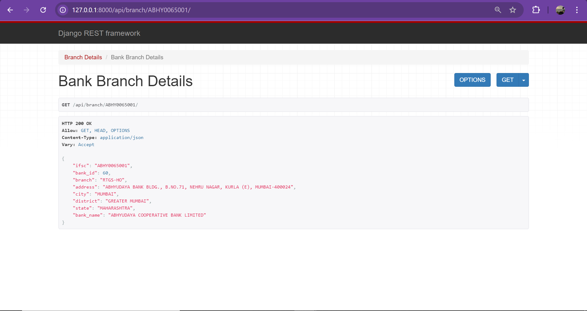

# Bank Query

A Django application for querying bank branch details.

## Overview

This project is a Django application designed to query and display information about bank branches. 

## Features
### Endpoint 1:
Provides details of all Banks present at a particular Branch

### Endpoint 2:
Provides details of Bank, for provided IFSC code

# Technologies Used

- Django 5.1.1
- Django REST Framework
- PostgreSQL
- Environment variables via `django-environ`

# Method
Created a Django app, and used djangorestframework to create REST-APIs, which returns JSON response when accessed.

## Time Taken- 5 hours